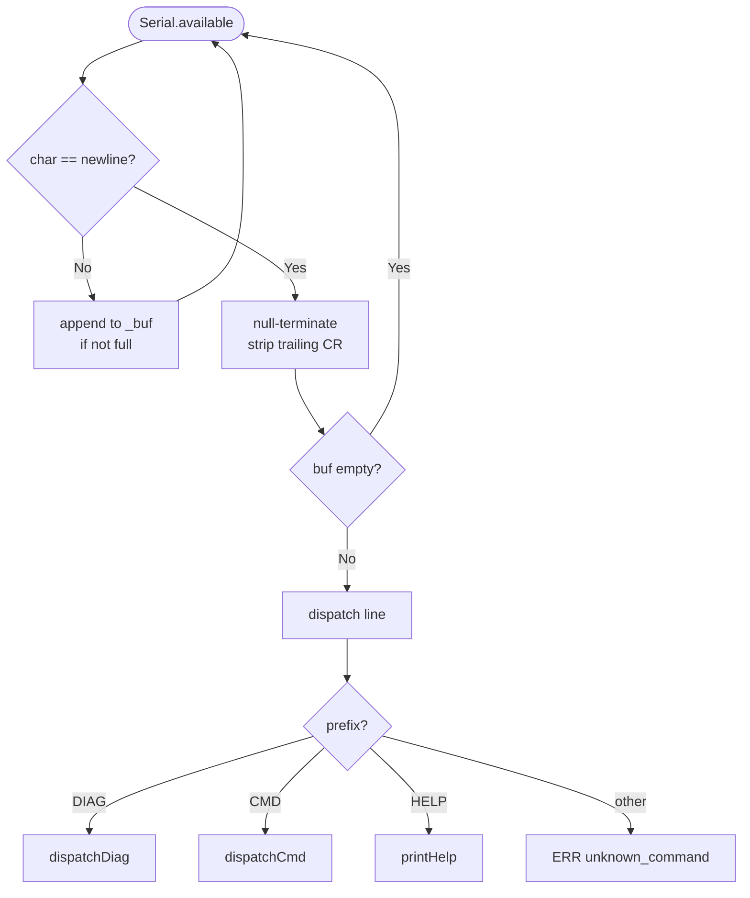
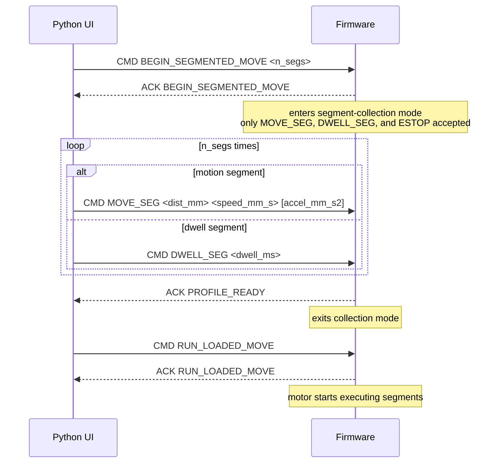

# Command Protocol

`command_parser.h` / `command_parser.cpp`

---

## Overview

All serial communication uses plain ASCII at **115200 baud**, `\n` or `\r\n` terminated.

There are two command namespaces:

| Prefix | Audience | Response |
|---|---|---|
| `CMD` | Python UI / automated control | Exactly one `ACK` or `ERR` per command |
| `DIAG` | Manual serial (human) | Free-format diagnostic output |
| `HELP` | Manual serial | Prints the command list |

---

## Response Format

```
ACK <VERB>                   — command accepted and executed
ERR <VERB> <reason_code>     — command rejected
STATE <state> <phase>        — response to CMD GET_STATE
```

---

## Line Accumulation



---

## CMD Command Reference

### Zero-argument commands

| Command | Valid states | Effect |
|---|---|---|
| `CMD HOME` | IDLE, READY, ERROR | Start homing sequence |
| `CMD GET_STATE` | Any | Print `STATE <state> <phase>` |
| `CMD STOP` | RUNNING, PAUSED, READY | Soft-stop → READY |
| `CMD ESTOP` | Any | Hard-stop → ERROR |
| `CMD PAUSE` | RUNNING | Snapshot state → PAUSED |
| `CMD RESUME` | PAUSED | Restore state → RUNNING |
| `CMD RUN_LOADED_MOVE` | READY | Execute loaded segment sequence |

### Commands with arguments

#### `CMD MOVE <dist_mm> [speed_mm_s] [accel_mm_s2]`

Move by a relative displacement.  Speed and accel default to `DEFAULT_DIP_SPEED_MM_S`
and `DEFAULT_ACCEL_MM_S2` (config.h) if not supplied or zero.

- Positive `dist_mm` = upward
- Negative `dist_mm` = downward
- Emits `CMD:MOVE:DONE` when complete
- Supports pause/resume

#### `CMD JOG <UP|DOWN> <speed_mm_s>`

Start continuous velocity motion.  Stop with `CMD STOP`.

#### `CMD RUN_PROFILE <dip_spd> <wdraw_spd> <accel> <depth_mm> <dwell_bot_ms> <dwell_top_ms> <n_dips>`

| Parameter | Unit | Description |
|---|---|---|
| `dip_spd` | mm/s | Descent speed |
| `wdraw_spd` | mm/s | Withdrawal speed |
| `accel` | mm/s² | Acceleration (symmetric) |
| `depth_mm` | mm | Dip depth below current position (positive) |
| `dwell_bot_ms` | ms | Time to dwell in solution |
| `dwell_top_ms` | ms | Time to dwell at top between dips |
| `n_dips` | — | Number of dip cycles |

All parameters must be positive; any zero/negative value returns `ERR RUN_PROFILE invalid_params`.

#### `CMD BEGIN_SEGMENTED_MOVE <n_segs>`

Enter segment-collection mode.  `n_segs` is the total number of segments
(MOVE_SEG + DWELL_SEG combined) that will follow.

#### `CMD MOVE_SEG <dist_mm> <speed_mm_s> [accel_mm_s2]`

Append a motion segment to the loaded buffer.  Only valid while in
segment-collection mode (after `BEGIN_SEGMENTED_MOVE`).

| Parameter | Unit | Description |
|---|---|---|
| `dist_mm` | mm | Signed displacement (+ve = up, -ve = down) |
| `speed_mm_s` | mm/s | Travel speed |
| `accel_mm_s2` | mm/s² | Acceleration (defaults to `DEFAULT_ACCEL_MM_S2` if 0) |

Counts as one segment toward `n_segs`.

#### `CMD DWELL_SEG <dwell_ms>`

Append a hold-position (dwell) segment to the loaded buffer.  Only valid
while in segment-collection mode.

| Parameter | Unit | Description |
|---|---|---|
| `dwell_ms` | ms | Time to hold position (must be > 0) |

Counts as one segment toward `n_segs`.  The motor does not move; the
firmware simply waits for the specified duration before advancing to the
next segment.

#### `CMD SET_TELEM_RATE <hz>`

Set telemetry stream rate.  Range: `0` (off) to `MAX_TELEM_RATE_HZ` (50).

#### `CMD SET_SOFT_LIMITS <min_mm> <max_mm>`

Override the soft limits.  `min_mm` must be strictly less than `max_mm`.
Valid states: IDLE or READY.

---

## Segmented Move Handshake

A segmented move is built up in three steps and uses a collection mode to
ensure all segments arrive before the motor starts.



**Aborting a collection:** Send `CMD ESTOP` at any point.  Any other command
during collection mode aborts with `ERR CMD segment_collection_aborted`.

---

## Error Codes

| Code | Meaning |
|---|---|
| `invalid_state` | Command not valid in the current system state |
| `invalid_params` | One or more numeric parameters are out of range |
| `bad_args` / `bad_speed` | Direction or speed argument malformed |
| `segment_collection_aborted` | Non-MOVE_SEG/DWELL_SEG command received during collection |
| `not_in_segment_collection` | MOVE_SEG or DWELL_SEG received outside collection mode |
| `bad_dwell_ms` | DWELL_SEG: dwell_ms is zero or negative |
| `seg_buffer_overflow` | More segments than `MOVE_SEG_BUFFER_SIZE` |
| `segment_collection_incomplete` | RUN_LOADED_MOVE before all segments received |
| `min_must_be_less_than_max` | SET_SOFT_LIMITS: min ≥ max |
| `out_of_range` | SET_TELEM_RATE: hz outside 0–50 |
| `unknown_cmd` | Verb not recognised in CMD namespace |
| `unknown_command` | Prefix not recognised (not CMD/DIAG/HELP) |

---

## DIAG Command Reference

DIAG commands do not follow the strict ACK/ERR protocol — they print
free-form diagnostic output for human reading in the serial monitor.

| Command | Effect |
|---|---|
| `DIAG MOTOR` | Move down 5 mm then up 5 mm; print completion |
| `DIAG MOTORENCODER` | Same + encoder accuracy PASS/FAIL |
| `DIAG ENDSTOP` | Live endstop monitor; print each state change |
| `DIAG MOVE <mm> [spd] [acc]` | Single move with PASS/FAIL result |
| `DIAG JOG DOWN [spd]` | Continuous jog downward |
| `DIAG JOG UP [spd]` | Continuous jog upward |
| `DIAG JOG STOP` | Stop active jog |
| `DIAG POS` | Print current position (mm) |
| `DIAG CAL <mm>` | Calibration move |
| `DIAG CAL RESULT <mm>` | Compute correction factor from measured distance |
| `DIAG EXIT` | Stop test, return to inactive |
| `HELP` or `DIAG CMD` | Print full command list |

---

## Number Parsing

The firmware uses `strtof()` / `strtol()` via helper functions `nextFloat()` and
`nextLong()`.  `sscanf()` is intentionally avoided because it is unreliable on
the STM32 standard library shipped with some Arduino cores.

The helpers advance a `char*&` pointer past each parsed token, so consecutive
arguments can be extracted by calling them in sequence on the same pointer.
