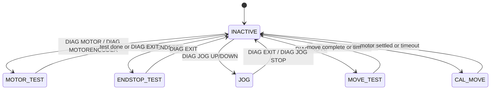
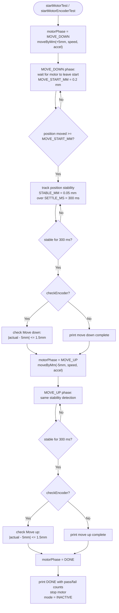
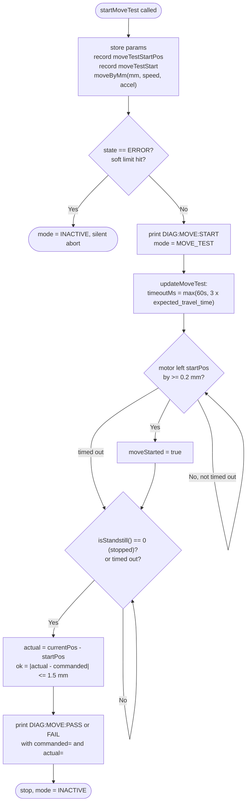
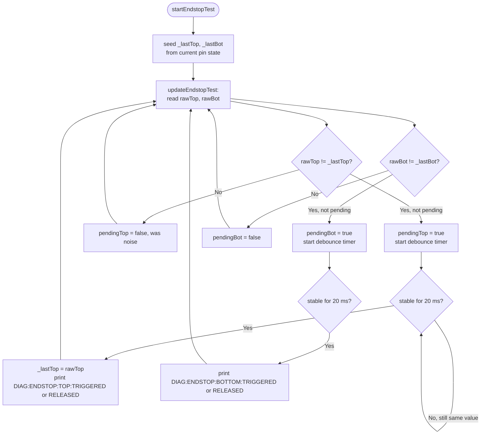
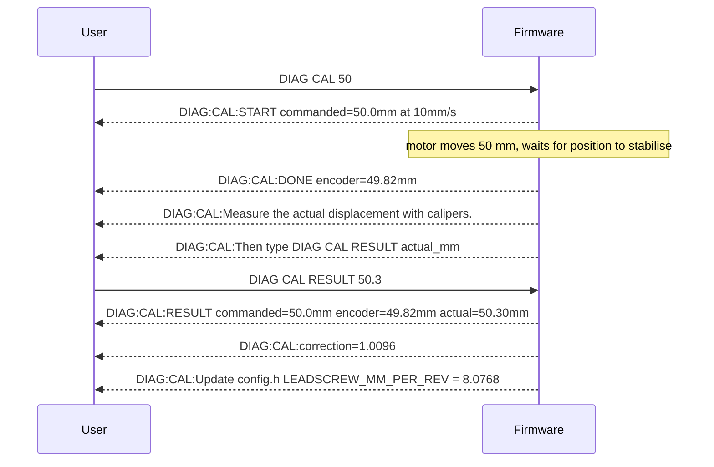

# Diagnostics Module

`diagnostics.h` / `diagnostics.cpp`

---

## Overview

The Diagnostics module provides hardware self-tests and a calibration utility.
It is driven by `DIAG` serial commands and runs all tests **non-blocking** through
its `update()` method — each test is a state machine that advances one step per
`loop()` iteration.

`Diagnostics` does **not** manage its own motor — it calls `MotionController`
methods for all motion.  It bypasses the `StateMachine` running/paused checks
(the motor is used in whatever state the system is in) but does check for
`ERROR` state after moves that might have been rejected by soft limits.

---

## Active Modes



---

## DIAG MOTOR / DIAG MOTORENCODER

Runs a simple two-leg move: down 5 mm then back up 5 mm.
`MOTORENCODER` variant also checks encoder accuracy against the commanded distance.



**Completion detection** in `updateMotorTest()` uses a **position-stability heuristic**:
the motor is considered stopped when position changes by less than `STABLE_MM` (0.05 mm)
over `SETTLE_MS` (300 ms).  This is reliable at `DIAG_SPEED_MMS` (2 mm/s) but would
fail at speeds below ~0.17 mm/s — use `DIAG MOVE` for slow-speed testing.

---

## DIAG MOVE

`DIAG MOVE <mm> [speed_mm_s] [accel_mm_s2]`

A precise single-move test with PASS/FAIL output.  Uses the **STANDSTILL signal**
for completion detection instead of the position-stability heuristic, making it
reliable at any speed down to 0.05 mm/s (tested).



**Why STANDSTILL instead of position stability?**

At slow speeds (e.g. 0.1 mm/s), the motor moves only 0.03 mm in 300 ms.
That is less than `STABLE_MM` (0.05 mm), so the stability heuristic would
declare the motor stopped before it has actually started moving.  The STANDSTILL
signal from the TMC5130 driver is independent of speed and is reliable at any
commanded velocity.

**Dynamic timeout:**
```
timeoutMs = max(60000,  3 x (|dist_mm| / speed_mm_s) x 1000)
```
This prevents false timeouts at very slow speeds — e.g. 10 mm at 0.1 mm/s
needs 100 s, which exceeds the 60 s fixed timeout.

---

## DIAG ENDSTOP

Live endstop monitor.  Prints each state change with a 20 ms debounce window.



> **Note:** While in `ENDSTOP_TEST` mode the ISR wrappers in the `.ino` file bypass
> `mc.onEndstopTriggered()` so manually pressing endstops does not trigger the
> limit-backoff logic.

---

## DIAG CAL (Calibration)

Used to measure and correct the `LEADSCREW_MM_PER_REV` constant in `config.h`.



**Correction formula:**
```
correction     = actual_mm / encoder_mm
new_mm_per_rev = LEADSCREW_MM_PER_REV x correction
```

If the correction is within 1% of 1.0, no change is needed.

**Completion detection** in `updateCalMove()` uses the same position-stability
heuristic as `updateMotorTest()` (SETTLE_MS / STABLE_MM), since the calibration
move is always run at `CAL_SPEED_MMS` (10 mm/s) where stability detection is reliable.

---

## DIAG JOG

Starts continuous velocity motion for manual stage positioning.
The motor runs until `DIAG EXIT` or `DIAG JOG STOP` is received.

`update()` does nothing in JOG mode — `MotionController.jog()` uses
`runContinous()` which the library drives autonomously.

---

## Constants Summary

| Constant | Value | Meaning |
|---|---|---|
| `DIAG_SPEED_MMS` | 2.0 mm/s | Default speed for DIAG MOTOR and DIAG MOVE |
| `DIAG_ACCEL_MMS2` | 5.0 mm/s² | Default acceleration |
| `CAL_SPEED_MMS` | 10.0 mm/s | Calibration move speed |
| `DIAG_DIST_MM` | 5.0 mm | Distance for DIAG MOTOR test |
| `TOLERANCE_MM` | 1.5 mm | Max error for PASS (DIAG MOTORENCODER, DIAG MOVE) |
| `MOVE_TIMEOUT_MS` | 60 000 ms | Minimum move timeout (DIAG MOVE scales this up) |
| `SETTLE_MS` | 300 ms | Stability window for motor-test completion |
| `STABLE_MM` | 0.05 mm | Max position drift to count as settled |
| `MOVE_START_MM` | 0.2 mm | Position change needed to detect that movement has started |
| `DEBOUNCE_MS` | 20 ms | Endstop debounce window |
