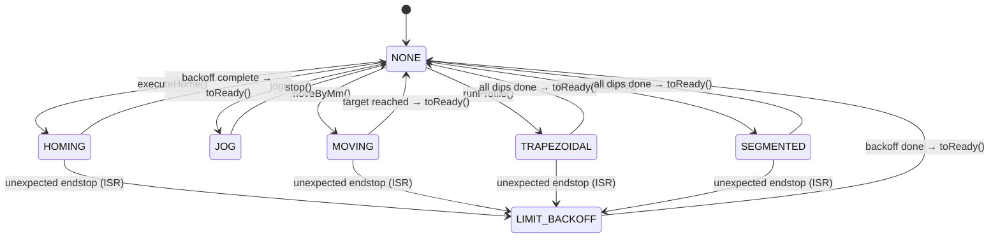
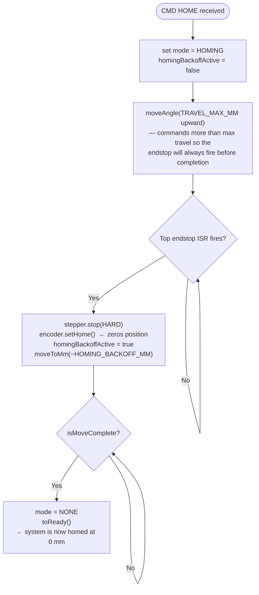
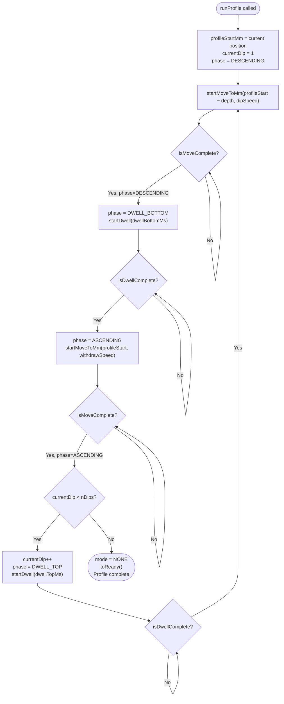
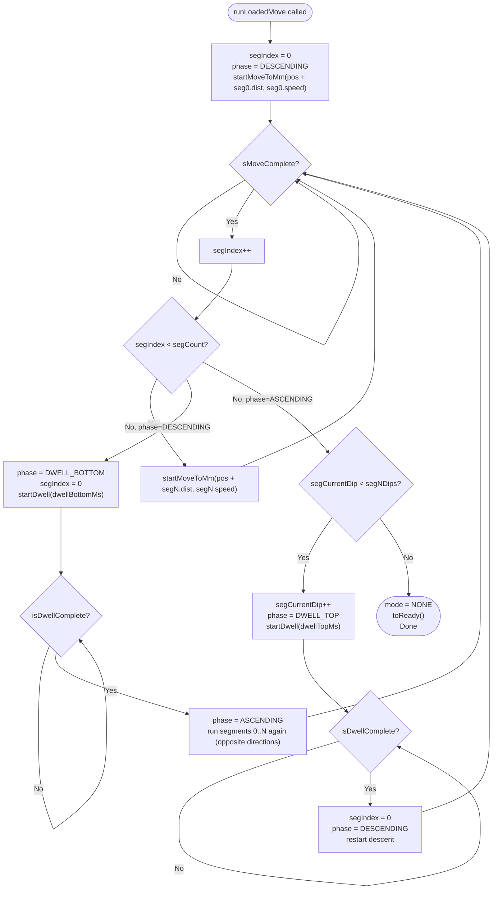
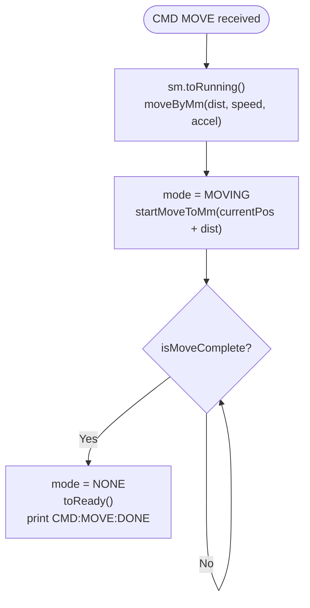
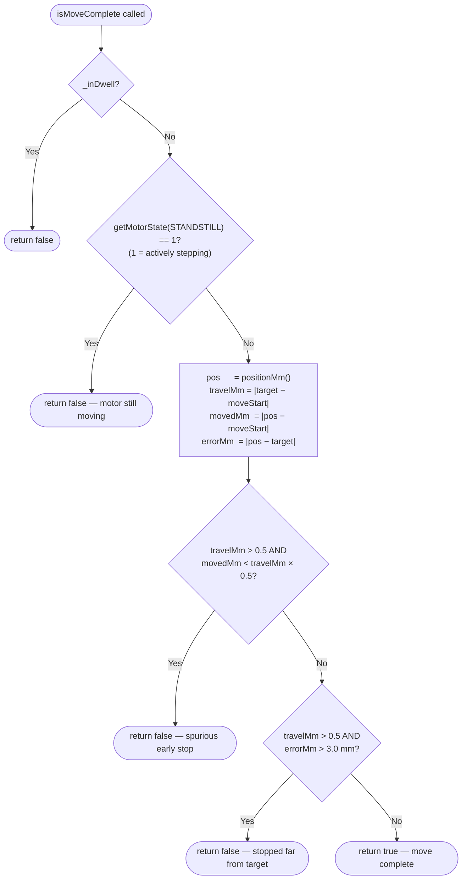

# Motion Controller

`motion_controller.h` / `motion_controller.cpp`

The MotionController owns the UstepperS32 stepper driver instance and is the
**single place in the firmware that issues commands to the motor**.  All public
methods are non-blocking: call `begin()` once from `setup()` and `update()` on
every `loop()` iteration.

---

## Internal Motion Modes (ProfileMode)

The controller uses an internal `ProfileMode` enum to track what the motor is
currently doing.  `update()` dispatches to the appropriate handler each loop.



---

## Homing Sequence

The motor must be homed before any positioning command is accepted.
Homing zeros the encoder at the top endstop.



**Why `moveAngle` instead of `runContinous`?**
`runContinous` forces SpreadCycle regardless of the TPWMTHRS register setting.
`moveAngle` keeps StealthChop active (quiet) during homing.

---

## Trapezoidal Profile

`CMD RUN_PROFILE dip_spd withdraw_spd accel depth_mm dwell_bot_ms dwell_top_ms n_dips`

Each dip cycle follows: Descend → Dwell at bottom → Ascend → Dwell at top → repeat.



**Key detail:** `profileStartMm` is recorded once when `runProfile()` is called.
All dip targets and return targets are computed relative to this fixed reference
so encoder drift between dips does not accumulate.

---

## Segmented Move

`CMD BEGIN_SEGMENTED_MOVE` → `CMD MOVE_SEG` × N → `CMD RUN_LOADED_MOVE`

A segmented move allows a user-defined speed profile — e.g. slow entry into the
solution, fast withdrawal.  Each segment is a signed displacement (mm) at a
given speed (mm/s).



---

## CMD MOVE (Single Relative Move)

`CMD MOVE <dist_mm> [speed_mm_s] [accel_mm_s2]`

A simple point-to-point move used for manual positioning.  Supports pause/resume.



**Pause / Resume for CMD MOVE:**

`moveByMm()` saves `speed` and `accel` into `_movingSpeedMms` / `_movingAccelMms2`.
On `resume()`, the MOVING branch re-commands `startMoveToMm(_targetMm, _movingSpeedMms)`,
continuing to the original absolute target from wherever the motor stopped.

---

## isMoveComplete() Logic

This function guards against false completion signals.



**STANDSTILL semantics (inverted from register name):**

| `getMotorState(STANDSTILL)` | Meaning |
|---|---|
| `1` | Motor is **actively stepping** |
| `0` | Motor has **stopped** |

This was confirmed empirically.  The TMC5130 datasheet defines STANDSTILL as a
flag that is set when the motor is stationary, but the UstepperS32 library
wraps it such that the return value is `1` while motion is in progress.

---

## Limit Backoff

When an endstop fires unexpectedly during motion, the firmware:

1. **ISR fires** → hard-stops the motor, sets `_limitTriggered = true`, mode = `LIMIT_BACKOFF`
2. **Next loop()** → `updateLimitBackoff()` reads `_limitTriggered`, prints a message,
   commands a short move away from the endstop, starts a 200 ms guard timer
3. **Subsequent loops** → waits for `isMoveComplete()` or a 5 s safety timeout,
   then transitions to READY

The two-pass approach (ISR sets flag, loop() acts on it) is necessary because
`startMoveToMm()` accesses shared state that is not ISR-safe to modify directly.

---

## Soft Limits

`CMD SET_SOFT_LIMITS <min_mm> <max_mm>`

Every call to `startMoveToMm()` passes the target through `checkSoftLimit()`.
If the target is outside `[_softLimitMinMm, _softLimitMaxMm]`:

1. An error message is printed with the offending target and current limits
2. `estop()` is called — hard-stop, mode = NONE
3. State transitions to `ERROR` with code `SOFT_LIMIT_EXCEEDED`

The defaults from `config.h` span the full physical travel range.

---

## Unit Conversions

The UstepperS32 library uses **degrees** for all positioning, while the rest of
the firmware uses **millimetres**.

```
degrees = mm × (360 / LEADSCREW_MM_PER_REV)
mm      = degrees × (LEADSCREW_MM_PER_REV / 360)
```

`LEADSCREW_MM_PER_REV` is defined in `config.h` and can be calibrated using
`DIAG CAL` — see [DIAGNOSTICS.md](DIAGNOSTICS.md).
