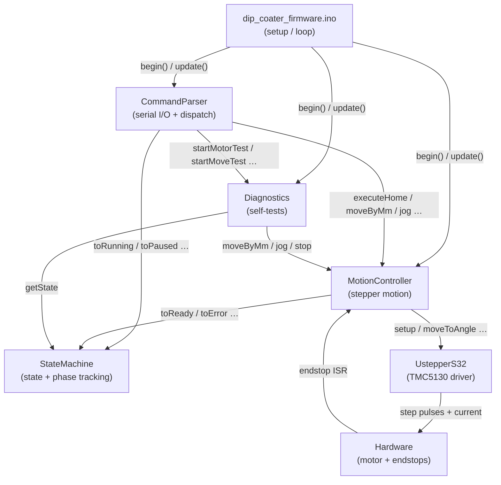
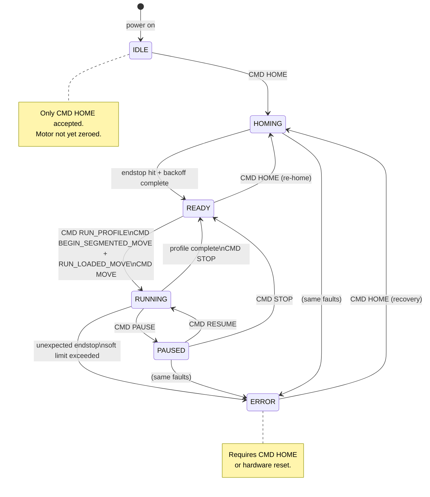
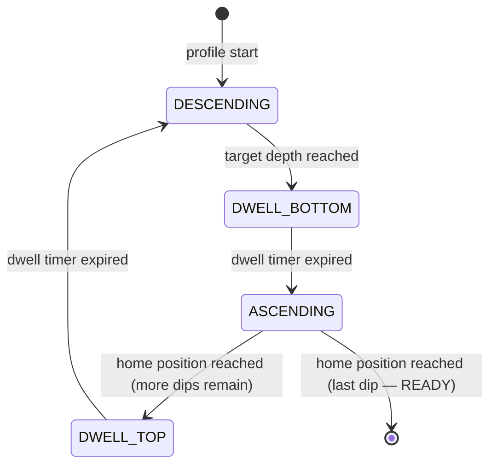
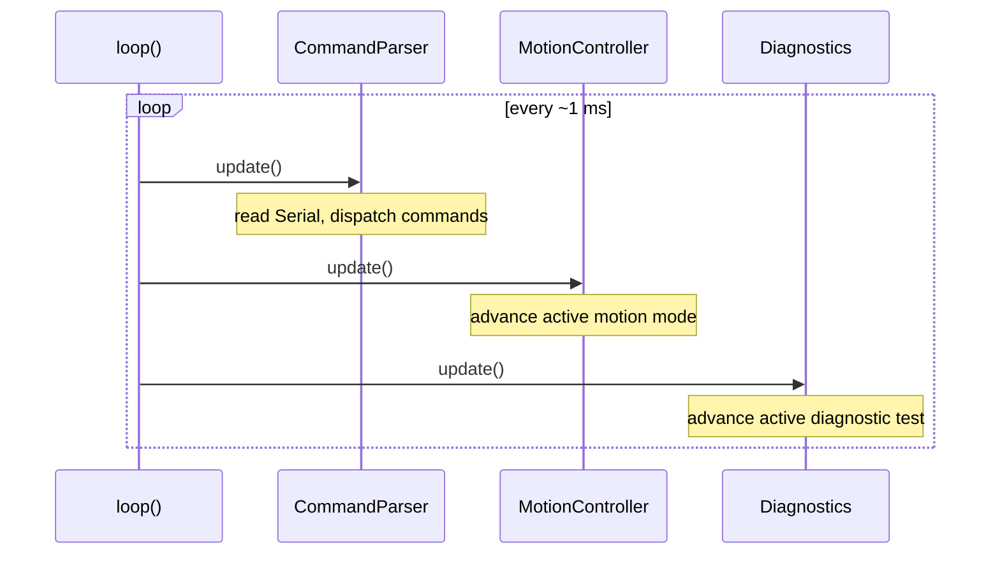

# Dip Coater Firmware — Architecture Overview

## Purpose

This firmware runs on a **uStepper S32** (STM32-based) board and controls a vertical
dip coater: a motor-driven stage that dips a substrate into a solution at programmable
speeds, dwells, and depths.

---

## Hardware

| Component | Detail |
|---|---|
| Microcontroller | uStepper S32 (STM32F103) |
| Stepper driver | TMC5130 (on-board, via UstepperS32 library) |
| Motor mode | StealthChop below ~3 mm/s, SpreadCycle above |
| Endstops | Active-LOW, INPUT_PULLUP; top = home, bottom = travel limit |
| Communication | USB-Serial, 115200 baud, UTF-8, `\n` or `\r\n` terminated |

### Coordinate system

```
Home position (top endstop) = 0 mm
Positive mm = upward   (toward home)
Negative mm = downward (into solution)
```

---

## Module Map



---

## Top-Level System States



---

## Run Phase (sub-state while RUNNING)

While in the `RUNNING` state the firmware tracks a finer **RunPhase** that
describes where in the dip cycle the system currently is.



> **Note:** For `CMD MOVE` (single-move mode) the phase stays at `NONE`
> throughout — phases only apply to trapezoidal and segmented profiles.

---

## main loop() call order



All three modules are **non-blocking** — they never call `delay()`.  The loop
runs at full MCU speed (≈ 1 MHz effective) so motion timing is smooth.

---

## File List

| File | Responsibility |
|---|---|
| `config.h` | All tunable constants (pin numbers, speeds, limits, motor geometry) |
| `state_machine.h/.cpp` | System state and run-phase enumerations and transitions |
| `motion_controller.h/.cpp` | Stepper motion — homing, profiles, jog, single moves |
| `diagnostics.h/.cpp` | Hardware self-tests triggered by DIAG commands |
| `command_parser.h/.cpp` | Serial line accumulation, command dispatch, response formatting |
| `trace.h` | Lightweight serial trace macros (zero cost when `TRACE` is not defined) |
| `dip_coater_firmware.ino` | Arduino sketch entry point — `setup()` and `loop()` |

---

## Detailed Documentation

- [State Machine](STATE_MACHINE.md)
- [Motion Controller](MOTION_CONTROLLER.md)
- [Command Protocol](COMMAND_PROTOCOL.md)
- [Diagnostics Module](DIAGNOSTICS.md)
