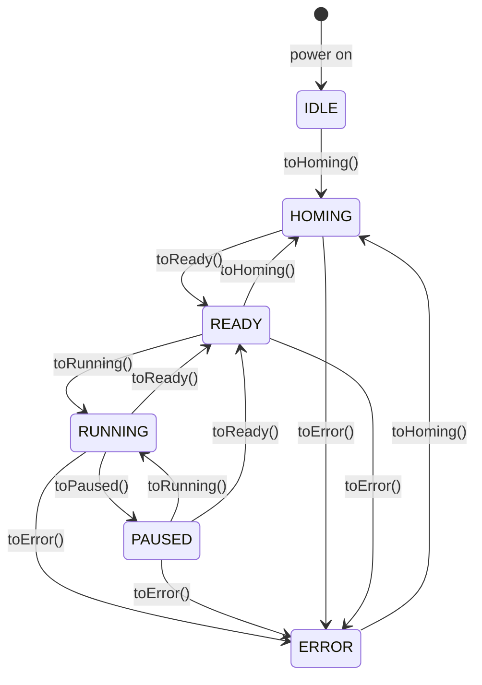
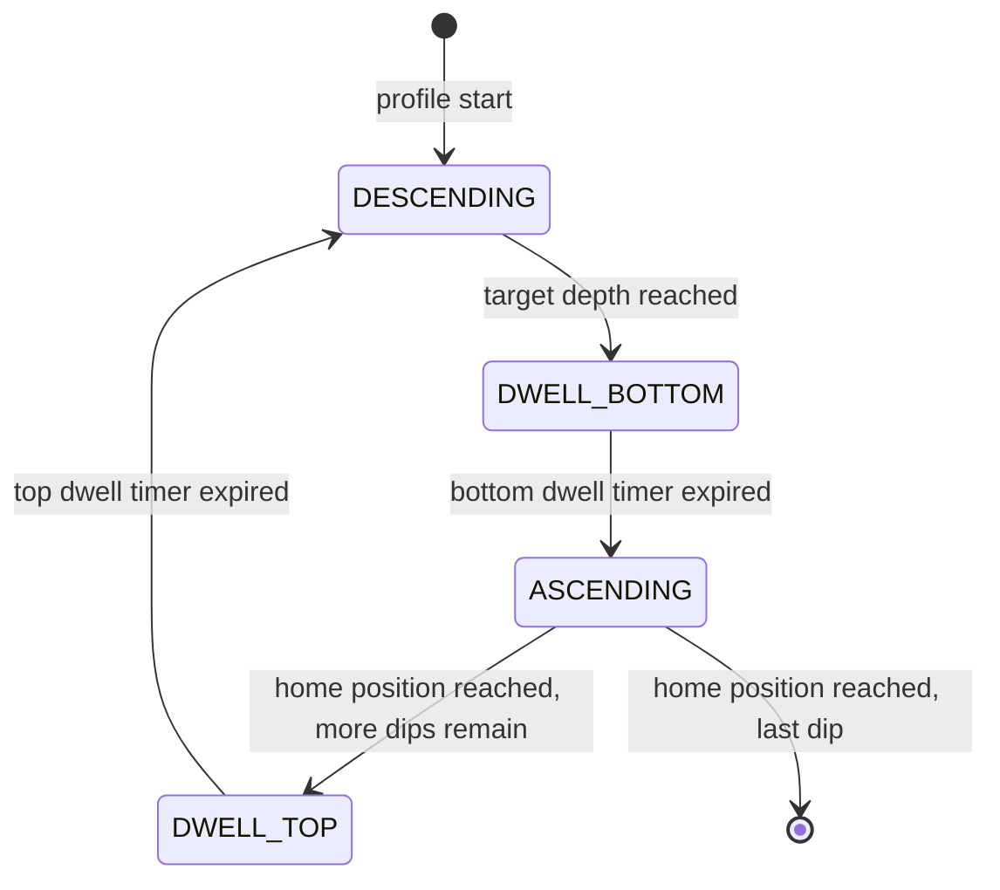

# State Machine

`state_machine.h` / `state_machine.cpp`

---

## Overview

The `StateMachine` class is the single source of truth for what the system is
currently doing.  No module writes the state directly — all changes go through
explicit transition methods (`toHoming()`, `toReady()`, etc.).  This keeps valid
transitions easy to audit and invalid ones easy to catch.

It holds three pieces of information:

| Field | Type | Meaning |
|---|---|---|
| `_state` | `SystemState` | Top-level operating state |
| `_phase` | `RunPhase` | Sub-phase within a running profile |
| `_error` | `ErrorCode` | Last recorded fault code |
| `_homed` | `bool` | Whether the system has been homed at least once |

---

## SystemState



### State descriptions

| State | Description | Accepted commands |
|---|---|---|
| `IDLE` | Powered on, encoder not zeroed | `CMD HOME` only |
| `HOMING` | Driving toward top endstop to zero encoder | `CMD ESTOP` |
| `READY` | Homed and stationary, all commands available | All CMD commands |
| `RUNNING` | Executing a profile or single move | `CMD PAUSE`, `CMD STOP`, `CMD ESTOP` |
| `PAUSED` | Mid-profile pause, position held | `CMD RESUME`, `CMD STOP`, `CMD ESTOP` |
| `ERROR` | Fault condition | `CMD HOME` (recovery), `CMD ESTOP` |

---

## RunPhase

`RunPhase` is a sub-state active only while `SystemState == RUNNING`.
It describes where in the dip cycle the motor currently is.



| Phase | Meaning |
|---|---|
| `NONE` | Not in a profile move (IDLE, HOMING, READY, PAUSED, or CMD MOVE) |
| `DESCENDING` | Motor moving downward toward the solution |
| `DWELL_BOTTOM` | Motor stationary at depth, waiting in solution |
| `ASCENDING` | Motor moving upward back toward the start position |
| `DWELL_TOP` | Motor stationary at top, waiting before the next dip |

> `CMD MOVE` (single relative move) keeps phase at `NONE` throughout —
> phases only apply to `RUN_PROFILE` and `RUN_LOADED_MOVE`.

---

## ErrorCode

When `toError()` is called, an `ErrorCode` is stored and can be retrieved
with `getError()`.  The code persists until the next `toHoming()` call (which
clears it) or until a new `toError()` overwrites it.

| Code | Trigger |
|---|---|
| `NONE` | `estop()` called with no specific fault |
| `ENDSTOP_TRIGGERED_UNEXPECTEDLY` | Endstop fired during normal motion |
| `SOFT_LIMIT_EXCEEDED` | `startMoveToMm()` target outside soft limit window |
| `COMMAND_INVALID_STATE` | CMD received in wrong system state |
| `COMMAND_PARSE_ERROR` | Malformed argument in a CMD command |
| `PROFILE_INVALID` | Zero or negative parameter in RUN_PROFILE or BEGIN_SEGMENTED_MOVE |
| `SEG_BUFFER_OVERFLOW` | More MOVE_SEG commands than MOVE_SEG_BUFFER_SIZE |

---

## Capability Queries

`CommandParser` uses these before issuing motion commands to avoid
writing repeated state checks inline:

| Method | Returns true when |
|---|---|
| `canRun()` | `state == READY` |
| `canPause()` | `state == RUNNING` |
| `canResume()` | `state == PAUSED` |
| `canJog()` | `state == READY` |

---

## Full Transition Table

| From | Event | To | Side effects |
|---|---|---|---|
| Any | `toHoming()` | HOMING | clears phase, clears error |
| HOMING | `toReady()` | READY | sets `_homed = true`, clears phase |
| READY | `toRunning()` | RUNNING | — |
| RUNNING | `toPaused()` | PAUSED | — |
| PAUSED | `toRunning()` | RUNNING | — |
| RUNNING / PAUSED / READY | `toReady()` | READY | clears phase |
| Any | `toError(code)` | ERROR | stores error code, clears phase |
| Any | `toIdle()` | IDLE | clears phase |
| RUNNING | `setPhase(ph)` | RUNNING | updates phase only, no state change |

---

## Serial Output Format

`CMD GET_STATE` returns a single line:

```
STATE <state> <phase>
```

Examples:
```
STATE READY NONE
STATE RUNNING DESCENDING
STATE PAUSED DWELL_BOTTOM
STATE ERROR NONE
```

The string representations come from `stateString()` and `phaseString()` —
these are also used in trace output when `#define TRACE` is enabled in `config.h`.
